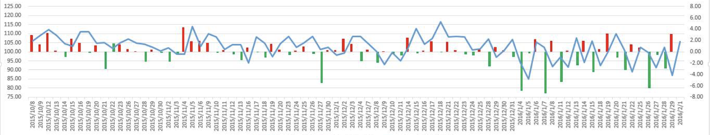
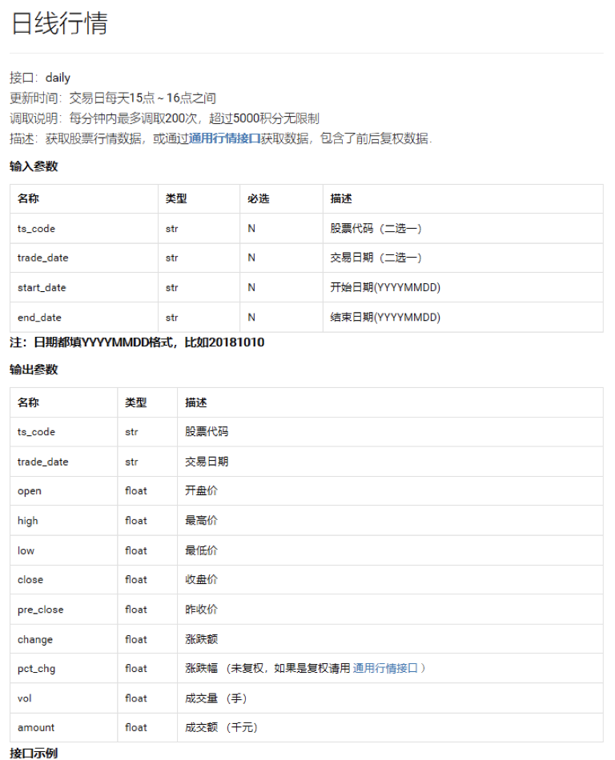
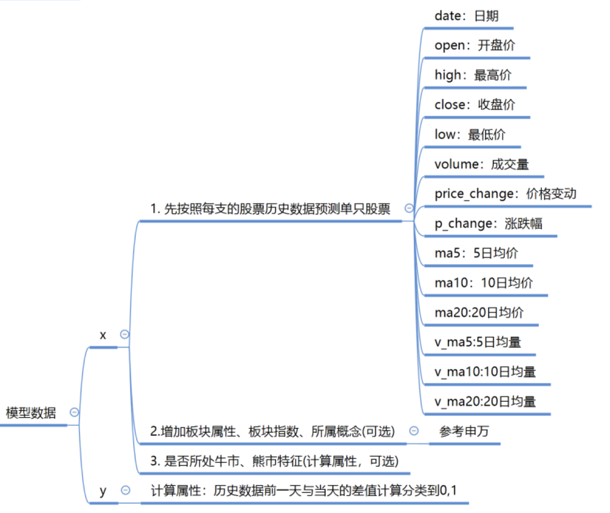
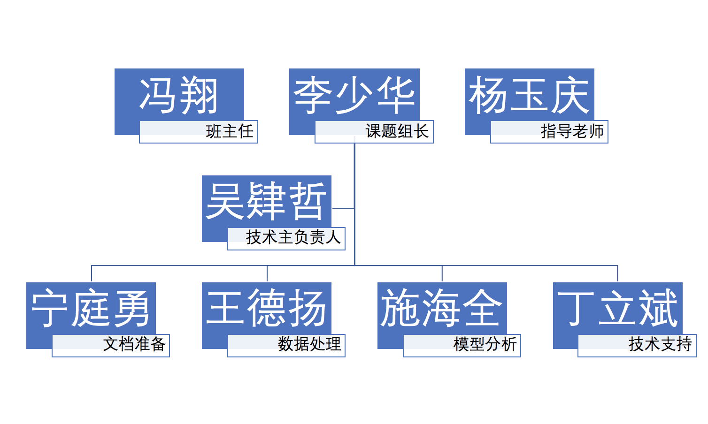
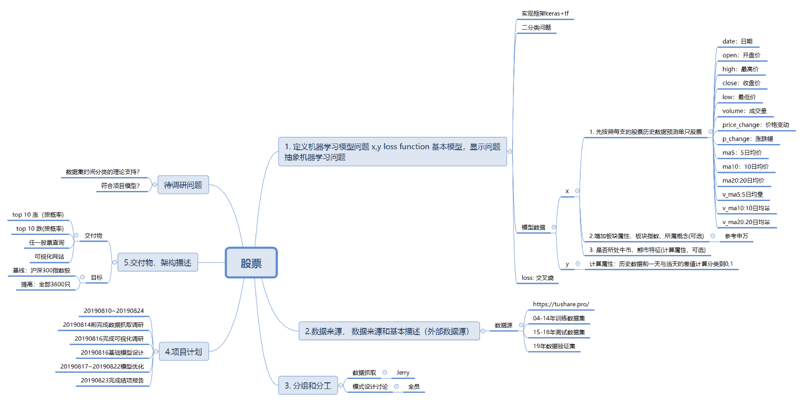

# 股票涨跌分析可行性报告-李少华组

## **问题定义**

#### **基于**Keras开源人工神经网络库在TensorFlow框架下基于股票历史日涨跌数据实现多支股票第二天涨跌二分类问题推理

##### **待研究问题：**

1、数据集时间分类的理论支持？

2、符合问题需求的模型筛选？

##### **交付物：**

1、一个前端的展示框架，用来显示：

A）Top10涨/跌股票排名

B）任意一只股票涨跌趋势查询

2、最终符合需求的网络模型分析

##### 项目计划：（8/10——8/24）

8/14完成数据抓取调研

8/16完成可视化调研和基础模型设计

8/17~8/22进行模型对比、调参和优化

8/23完成结项报告

## **数据来源** 

## https://tushare.pro/

**调取分析对象日交易数据（所有交易数据）**

04-14年为训练数据集

15-18年为测试数据集

​    -19年为验证数据集

在此基础上加入股票所属的板块来做模型参数扩充

## 数据模型

### 有丰富的行情数据和财务数据及可扩展的指标分析项目

## 项目组织及分工

